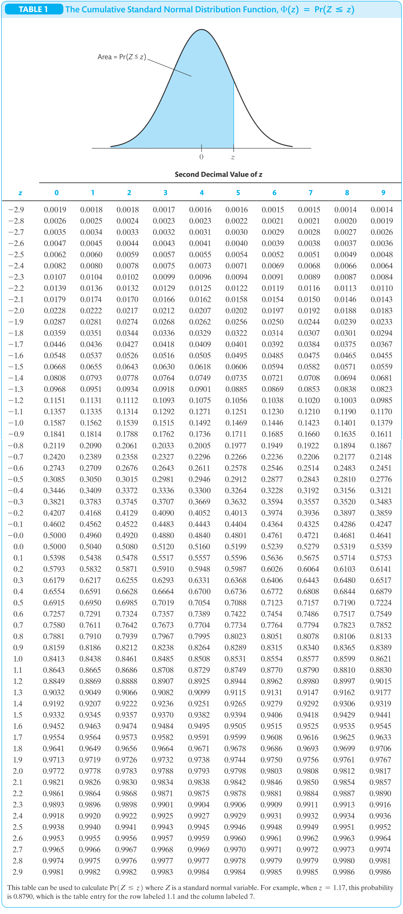

---
html_document:
  highlight: tango
  css: style.css
  includes:
    in_header: header_01.html
runtime: shiny
---

<!-- see: https://stackoverflow.com/questions/31391459/how-can-i-expand-a-child-div-to-100-screen-width-if-the-container-div-is-smalle -->

````{=html}

<!-- <div class="logos" style="text-align:center; background-color:'#eeeeee'; width=100vw; margin-left:-50vw; left: 37%; position: relative;"> -->
<!--   <br /> -->
<!--    -->
<!--   <br /> -->
<!--     <p> Econometrics and Statistics (520K) </p> -->
<!-- </div> -->

````

````{=html}

<div class="logos" style="text-align:center; background-color:'#eeeeee';">
  <br />
  
  <br />
    <p> Econometrics and Statistics (520K) </p>
</div>

````

````{=html}
```{r, include=TRUE, echo=FALSE, results='asis'}
xfun::file_string('header_02.html')
```
````

```{r setup, include=FALSE}
knitr::opts_chunk$set(message = FALSE,
                      error = FALSE)
```

```{r, include=FALSE, echo=FALSE}

# # packages used for the application
# pac <- c("rstudioapi", "shiny", "rmarkdown")
# 
# # install and/or load packages
# checkpac <- function(x) {
#   if (!require(x, character.only = TRUE)) {
#     install.packages(x)
#   }
#   require(x, character.only = TRUE)
# }

```

```{r, include=FALSE, echo=FALSE}

# # set working directory
# wd <- dirname(rstudioapi::getSourceEditorContext()$path)
# setwd(wd)

```


````{=html}

<style>

body{
  font-family: Helvetica;
  font-size: 16pt;
}

/* For collapsible No 2*/
.collapsible02 {
  margin-top: 5px;
  margin-bottom: 5px; 
  background-color: white;
  color: #333333;
  font-style: italic;
  cursor: pointer;
  width: 100%;
  padding: 5px;
  border: 1px solid;
  border-color: #cccccc;
  text-align: left;
  outline: none;
  font-family: Helvetica;
  font-size: 16pt;
}

.cod_content {
  display: none;
}

.col_content {
  display: none;
  background-color: #EAECEE;
  padding-top: 5px;
  padding-right: 10px;
  padding-bottom: 5px;
  padding-left: 10px;
}

</style>

````


<!-- .................................................. -->
<hr>

# Illustrations of Hypothesis Tests

<!-- .................................................. -->
<hr>

<span style="text-decoration: underline; font-size: 18pt">Instructions</span><span style="font-size: 18pt">: Input</span>

The *app* below contains an *illustration of hypothesis tests*.

Use the *slider* to change the value of the *actually observed test statistic* $t^{act}$.

Select the *type* of the *test* $\left(\text{w.r.t. } H_0\right)$ by using the *drop-down list*.


<!-- .................................................. -->
<hr>

<span style="text-decoration: underline; font-size: 18pt">Explanation</span><span style="font-size: 18pt">: Output</span>

The first plot (*Probability Density Function (PDF)*) shows the probability density of the *actually observed test statistic* $t^{act}$ under the null hypothesis $\left(H_0\right)$. 

The second plot (*Cumulative Distribution Function (CDF)*) shows the cumulative distribution function corresponding to the *PDF* for the *actually observed test statistic* $t^{act}$ under the null hypothesis $\left(H_0\right)$. 


<!-- .................................................. -->
<hr>

```{r hyp_tes, echo=FALSE, warning=FALSE, message=FALSE, include=TRUE}
shinyAppDir(appDir = "./ShinyApplication",
            options = list(width = "100%", height = 900
  )
)
```

<!-- .................................................. -->
<hr>

<!-- <span style="text-decoration: underline; font-size: 16pt">Comparison with Table</span> -->

<!-- <p class="head03"> -->
<!-- CDF Standard Normal Distribution -->
<!-- </p> -->

<!--..........................................................................-->
<button type="button" class="collapsible02"> *Compare with CDF Table* </button>
<div class="col_content">



<p style="font-size: 12pt; font-style: italic; float: right">
Source: Stock and Watson (2020), p. 763-764
</p>

</div>
<!--..........................................................................-->


<!-- .................................................. -->
<hr>

<span style="text-decoration: underline; font-size: 18pt">Remember</span><span style="text-decoration: none; font-size: 18pt">: \(p\)-value</span>

* The $p$-value is the probability of observing a value of $\widehat{\beta}$ at least as different from $\beta_{H_0}$ as the estimate actually computed $\left(\widehat{\beta}^{act}_1\right)$, assuming that the *null hypothesis* is correct.
* *Type I error*, i.e. rejecting $H_0$ even if it is true.


````{=html}

<script>

var coll = document.getElementsByClassName("collapsible02");
var i;

for (i = 0; i < coll.length; i++) {
  coll[i].addEventListener("click", function() {
    this.classList.toggle("active");
    var content = this.nextElementSibling;
    if (content.style.display === "block") {
      content.style.display = "none";
    } else {
      content.style.display = "block";
    }
  });
}

</script>

````


